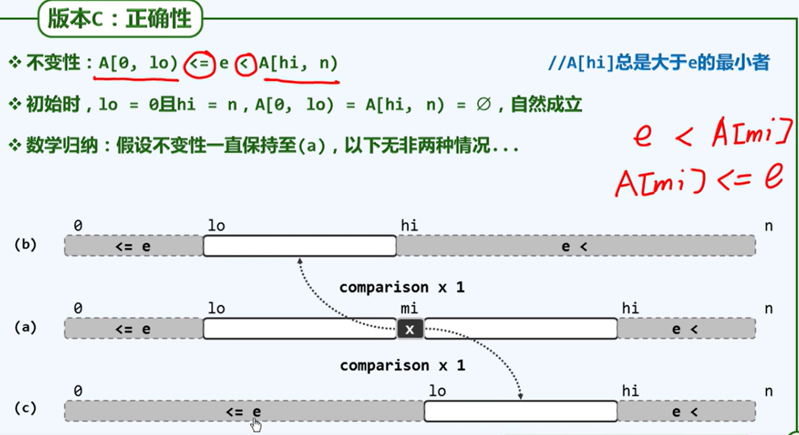

使用例子：

给定一个按照升序排列的长度为 $n$ 的整数数组，以及 $q$ 个查询。

对于每个查询，返回一个元素 $k$ 的起始位置和终止位置（位置从 $0$ 开始计数）。

如果数组中不存在该元素，则返回 `-1 -1`。

#### 输入格式

第一行包含整数 $n$ 和 $q$，表示数组长度和询问个数。

第二行包含 $n$个整数（均在 $1∼10000$ 范围内），表示完整数组。

接下来 $q$行，每行包含一个整数 kk，表示一个询问元素。

#### 输出格式

共 $q$ 行，每行包含两个整数，表示所求元素的起始位置和终止位置。

如果数组中不存在该元素，则返回 `-1 -1`。

#### 数据范围

$1≤n≤100000$

$1≤q≤10000$	
		
$1≤k≤10000$

#### 输入样例：
1k≤10000
```
6 3
1 2 2 3 3 4
3
4
5
```

#### 输出样例：

```
3 4
5 5
-1 -1
```


## 题解

```c++
#include <iostream>

using namespace std;

const int N = 100010;
int a[N];

int bsearch1(int x, int lo, int hi) {
    while (lo < hi) {
        int mid = (lo + hi) >> 1;
        x <= a[mid] ? hi = mid : lo = mid + 1;
    }
    return lo;
}

int bsearch2(int x, int lo, int hi) {
    while (lo < hi) {
        int mid = (lo + hi) >> 1;
        x < a[mid] ? hi = mid : lo = mid + 1;
    }
    
    return lo - 1;
}


int main() {
    ios::sync_with_stdio(false);
    cin.tie(0);
    
    int n, q;
    cin >> n >> q;
    
    for (int i = 0; i < n; i ++) cin >> a[i];
    
    while (q --) {
        int x;
        cin >> x;
        int l = bsearch1(x, 0, n);
        if (a[l] != x) {
            cout << "-1 -1" << endl;
        }
        else {
            int r = bsearch2(x, 0, n);
            cout << l << " " << r << endl;
        }
    }
}
```

