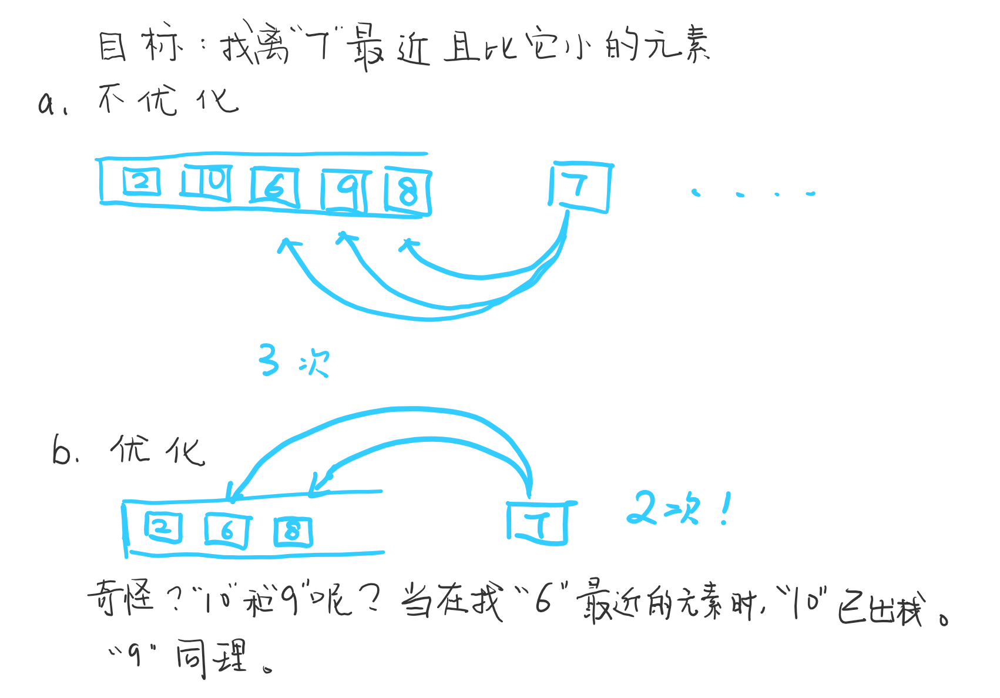

## 模型
描述这样一个问题， 给定一个序列， 给出序列中每个元素对应的离他最近的且比它小（或大）的元素值。

类似于单调队列， 此模型可使用单调栈来求解。 

假定求的是离元素最近且比它小的元素值这样一个模型， 从左到右（或从右到左）遍历每个元素， 对每个元素的求解过程中， 
维护这样一个单调栈， 使得在栈中比它大的元素出栈， 直到找到对应元素或栈空为止， 该元素添加到栈顶中， 继续遍历下一个元素。 
这样一来， 栈中的元素必定是单调递增的。 过滤掉了不必比较的元素， 优化效率取决于序列中各个子区间单调递减的元素个数。 

说了这么多， 来看个简单的图例来描述怎么进行优化的。




给定一个长度为 N 的整数数列，输出每个数左边第一个比它小的数，如果不存在则输出 −1。

## 题目
**输入格式**
		第一行包含整数$N$，表示数列长度。

第二行包含 $N$ 个整数，表示整数数列。

**输出格式**
		共一行，包含 $N$ 个整数，其中第 $i$个数表示第 $i$个数的左边第一个比它小的数，如果不存在则输出 $−1$。

**数据范围**
		$1≤N≤10^5$
		$1≤数列中元素≤10^9$
		**输入样例**：
		$5$
		3 4 2 7 5
		**输出样例**：
		-1 3 -1 2 2


**题解**

```c++
#include <iostream>
#include <stack>
using namespace std;

int main() {
    stack<int> s;
    int n;
    cin >> n;
    
    int e;
    for (int i = 0; i < n; i ++) {
        cin >> e;
        while (!s.empty() && s.top() >= e) {
            s.pop();
        }
        if (s.empty()) cout << "-1 ";
        else cout << s.top() << " ";
        s.push(e);
    }
    return 0;
}
```


